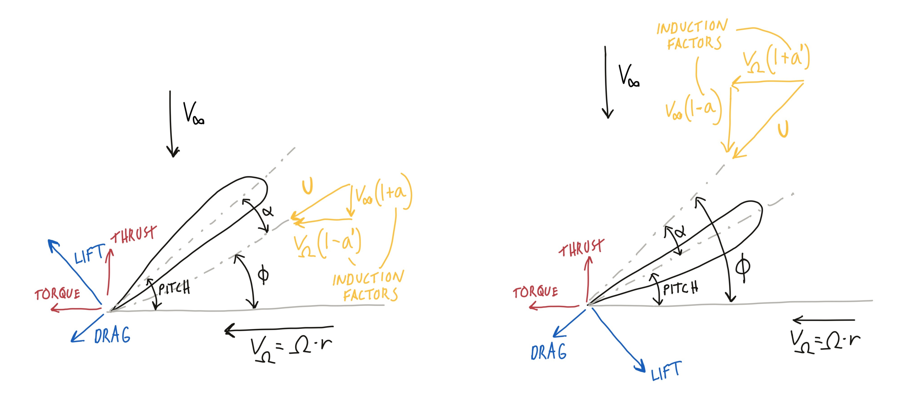
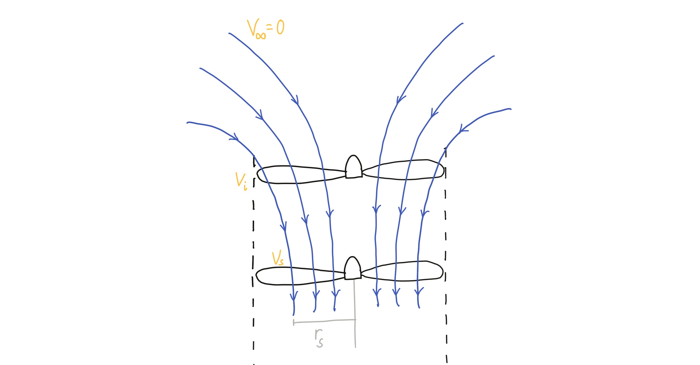

.. _theory:

Theory
======

The Blade Element Momentum Theory
---------------------------------

This section contains a brief overview of the Blade Element Momentum Theory. The emphasis is on providing
unified expressions that are valid for both turbines and propellers. More thorough derivations can be found
elsewhere, e.g. [HANSEN2008]_ for wind turbines and [LEISHMAN2000]_ for helicopter propellers.

Blade Element Momentum Theory is a combination of two theories; the blade element theory and the momentum theory.
In blade element theory, we assume that each small section of a blade operates independently and calculate 
forces based on tabulated values for lift and drag for the airfoil. In momentum theory, the rotor is treated
as a disk where momentum is lost due to the work done by the rotor.

For a propeller, we apply power to the rotor to generate thrust along the rotation axis. For a turbine, we 
use the incoming flow to extract power generated from the torque of the rotation.  
The above figure shows a force diagram for these two situations, respectively.
A key concept in BEMT
is the induction factors. The velocity that a blade section sees is not the actual incoming flow velocity in
the axial direction or the angular velocity of the rotor in the tangential velocity. For a propeller, the 
axial velocity is increased due to the presence of the rotor and the tangential velocity is reduced due to swirl.
For a turbine, the opposite occurs. This can be expressed in a unified manner by introducing a constant, 
:math:`C`, which is 1 for a propeller and -1 for a turbine. The local velocities can then be expressed as

        .. math::
            v = (1 + Ca)V_\infty \\
            v' = (1 - Ca')\Omega R \\
            U = \sqrt{v^2+v'^2} \\

The forces on the rotor section can be written as

        .. math::
            \Delta T = \sigma\pi\rho U^2C_T r\Delta r \\
            \Delta Q = \sigma\pi\rho U^2C_Q r^2\Delta r \\

where :math:`\sigma=Bc/(2\pi R)` is the rotor solidity. The thrust and torque coefficients are calculated
from the following expressions:

        .. math::
            C_T = C_l\cos{\phi} - CC_d\sin{\phi} \\
            C_Q = C_l\sin{\phi} + CC_d\cos{\phi} \\

:math:`C_l` and :math:`C_d` are drag and lift coefficients that are found from airfoil tables, using the
local angle of attack for the airfoil, 

        .. math::
            \alpha = C(\text{pitch} - \phi)

Similar expressions for the forces can also be found from momentum theory,

        .. math::
            \Delta T = 4\pi\rho r V_\infty^2(1 + Ca)a\Delta r \\
            \Delta Q = 4\pi\rho r^3 V_\infty\Omega(1 + Ca)a'\Delta r \\

Combining these equations, we can find expressions for the induction factors directly as

        .. math::
            a = \frac{1}{\kappa - C} \\
            a' = \frac{1}{\kappa' + C} \\
            \kappa = \frac{4\sin^2{\phi}}{\sigma C_T} \\
            \kappa' = \frac{4\sin{\phi}\cos{\phi}}{\sigma C_Q} \\

Solution method
---------------

From the rotor force diagram, we see that the local inflow angle can be expressed from the local velocities as

        .. math::
            \tan \phi = \frac{(1+Ca)\Omega R}{(1-Ca')V_\infty}

To find the solution of this system of equations, we apply root-finding functions from the SciPy library
to this equation to find :math:`\phi`, where the induction factors are calculated from the above expressoins. 
Finally, the forces are calculated from the blade element equations and integrated along the rotor to find 
the total forces.

Coaxial model
-------------

For a coaxial rotor setup the lower rotor will be in the slipstream created by the upper rotor, as illustrated
in the above figure. This situation is modelled here by applying an inflow velocity only on the rotor sections 
that are inside the slipstream. The velocity and size of the slipstream is found by momentum theory.

Only the case of a hovering rotor, i.e. zero velocity inflow on the upper rotor, is currently implemented.
It is also assumed that the lower rotor is a sufficient distance below the upper rotor so that the slipstream
is fully develped. For this case, the continuity equation gives

        .. math::
            V_i \pi r^2 = V_s \pi r_s^2 \\

For the momentum, the thrust generated from the upper rotor is equal to the change in momentum from the still
region to the slipstream,

        .. math::
            T = \rho V_i A V_s \\

Finally, the work done by the upper rotor is equal to the kinetic energy in the slipstream

        .. math::
            T V_i = \frac{1}{2}\rho V_i A V_s^2 \\

From these equations the following expressions for the slipstream properties are found:

        .. math::
            r_s = \frac{r}{\sqrt{2}} \\
            v_s = C_s\sqrt{\frac{2 T}{\rho A}} \\

Here, :math:`C_s` is a model constant.

.. [HANSEN2008] Hansen,  M.O.L.  2008. Aerodynamics of Wind Turbines. Earthscan Publications Ltd.
.. [LEISHMAN2000] Leishman,  J.G.  2000.  Principles  of  Helicopter  Aerodynamics.  Cambridge  University  Press. 
