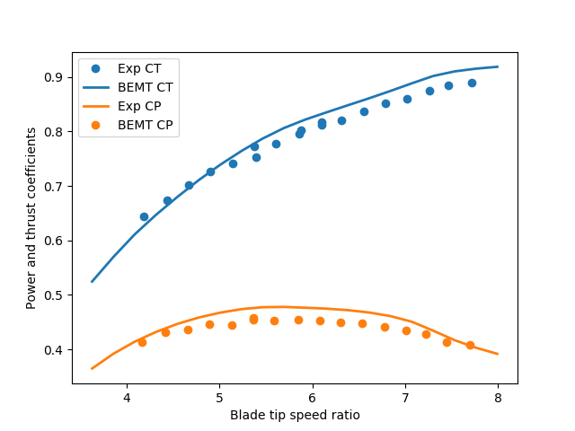
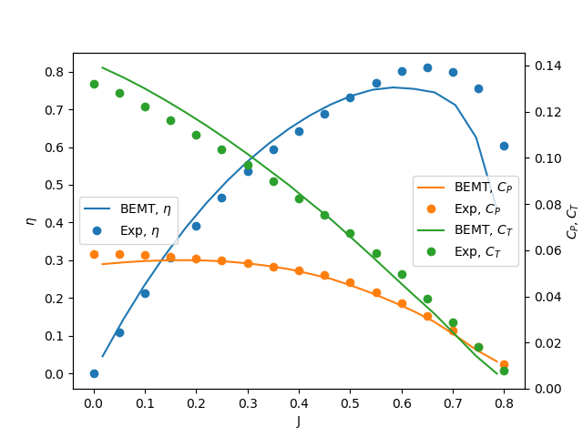

Validation
==========

This chapter provides some comparisons of `pyBEMT` with
experimental results on turbines and propellers.
The source code to run these simulations are found in the
examples directory of the repository.

Tidal stream turbine
--------------------

In this example the power and thrust of a tidal stream turbine is compared
against results from the experiments presented in [BAHAJ2007]_. The airfoil
data are obtained from XFOIL using the Viterna extrapolation method to obtain
360 polars.

The figure below shows the simulated power and thrust coefficients compared to
the experimental results, and good agreement can be observed.

Propeller
---------

In this example the thrust, torque and efficiency of an airplane propeller is
compared against results from the experiments presented in [THEODORSEN1937]_.
The test case used for comparison is propeller C at a pitch angle of 15
degrees. The propeller uses the CLARK Y airfoil, and the airfoil data are
obtained from XFOIL. Note that as pointed out in [MORGADO2015]_, there is a
difference in the definition of pitch angle used in the report compared to
common practice today. Hence, the pitch in the simulations is adjusted by 2
degrees compared to the pitch in the report.

The figure below shows the simulated power and thrust coefficients along with
the propeller efficiency compared to the experimental results, and good
agreement can be observed.

.. [BAHAJ2007] Bahaj A.S., et al. "Power and thrust measurements of marine current turbines under various hydrodynamic flow conditions in a cavitation tunnel and a towing tank." Renewable Energy 32.3 (2007): 407-426.

.. [THEODORSEN1937] Theodorsen T., Stickle G.W. and Brevoort, M.J. "Characteristics of six propellers including the high-speed range." Report no. 594-National Advisory Committee for Aeronautics (1937). 

.. [MORGADO2015] Morgado J., Silvestre M.A.R. and Páscoa J.C. "Validation of new formulations for propeller analysis." Journal of Propulsion and Power 31.1 (2015): 467-477.

